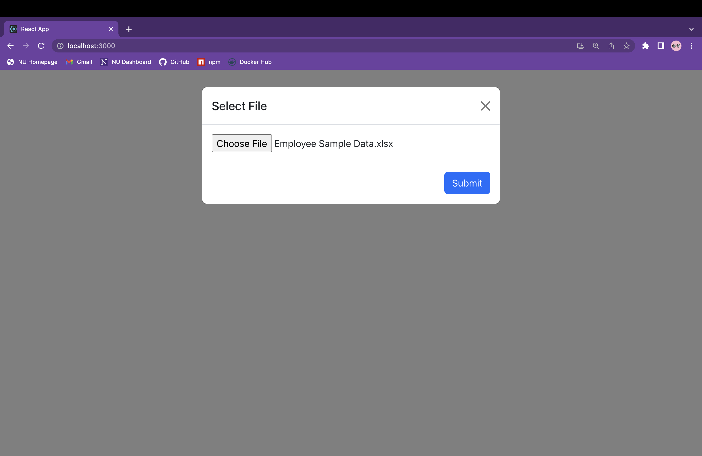
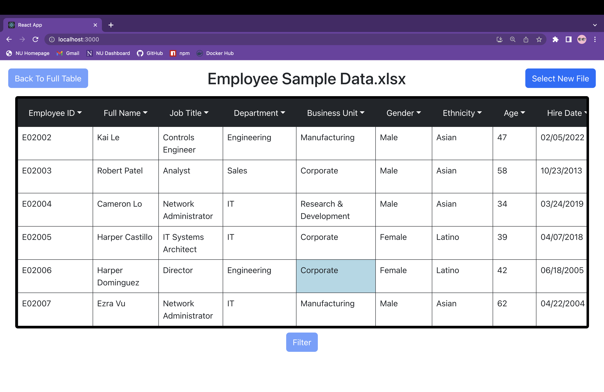
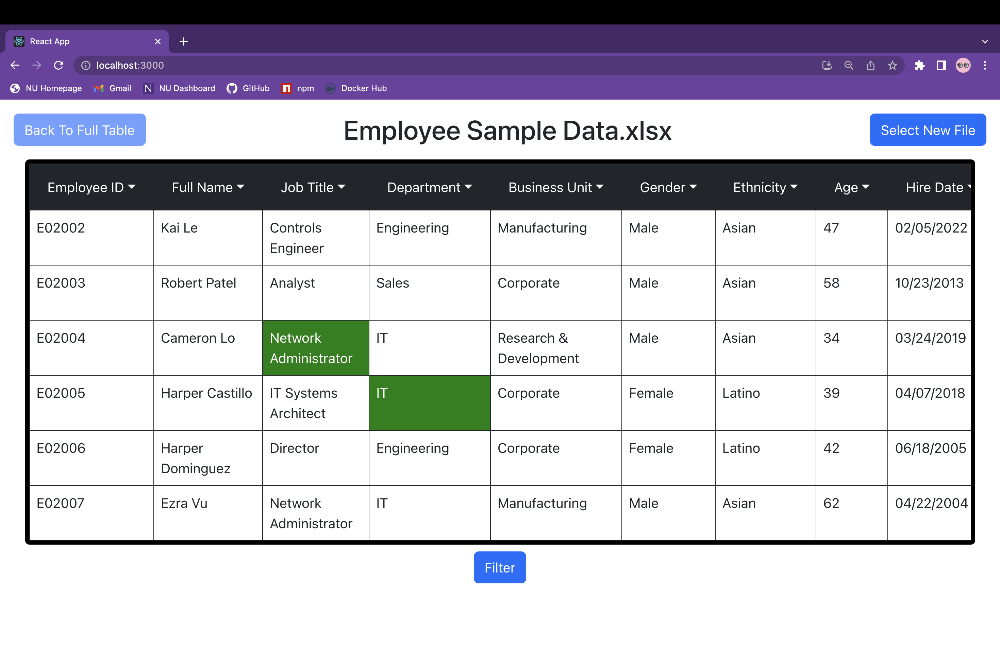
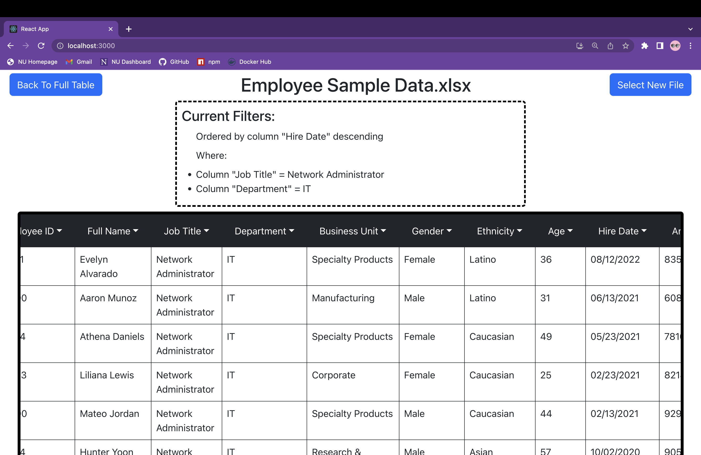
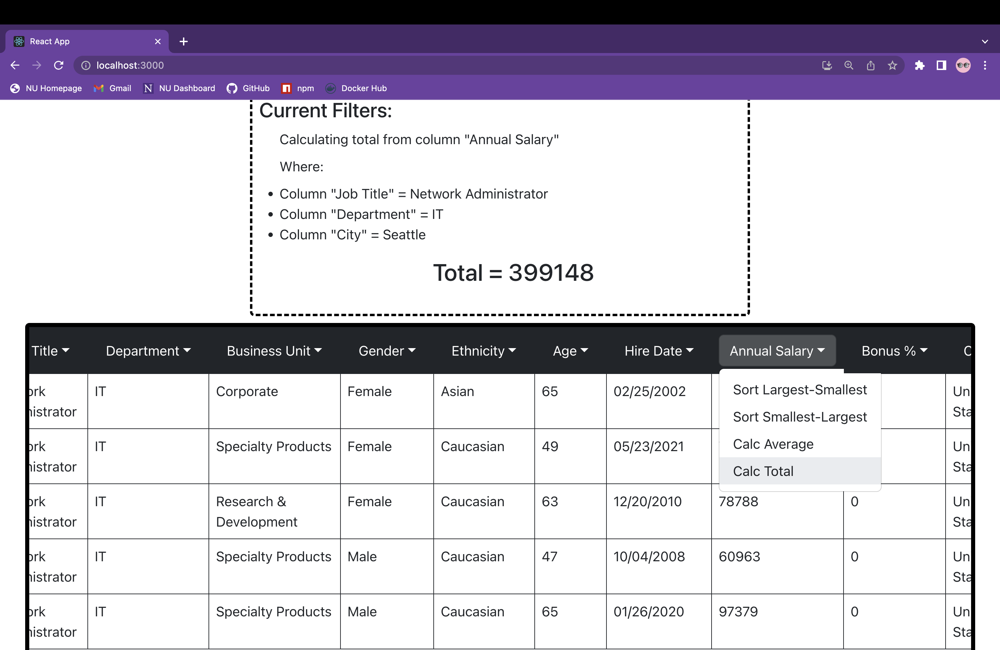

# dynamic-data-query

## Description

Dynamic Data is to be a web application where users can import an excel file and have their file rendered back to them on the webpage. Designed for users with minimal data skills, the UI provides an easy and intuitive way of filtering and organizing the data as well as calculating totals and averages.

## Table of Contents 

- [Usage](#usage)
- [License](#license)

## Installation

Application is not deployed yet.

## Usage

To start users have the ability to import any kind of excel file.

Once the table has been loaded users can then click on any cell as means of a search or filter. Once they are happy with their selections they can click filter and the table will only display rows that match their filter criteria.

At any point the user can click on the column names at the top and select any options for that column. These options do not filter the table but provide extra ways to orient the data, or do calculations. If the data is of type string the only option is to group alphabetically. Similarly, dates can only be sorted newest-oldest or oldest-newest. Numbers however can be sorted largest-smallest and vice versa, and the application can calculate the average and totals for that perticlar column. 

These calculations and orderings can be used at any time, with or without current filters.

## Future-Development

- Currently the application was built using docker and it will be deployed with AWS once the UI has been polished a bit more. Since it consists of three docker images it will be deployed using EKS or ECR rather easily. 

- Currently the application allows users to only import excel files. Soon there will be a new route that allows users to import csv files as well.

- Lastly I plan to make the web application downloadable to that users can utilize it locally without internet connection. Bundling the multiple services of the application will pose some challenges but it is a task I hope to complete.

## License

This application has the MIT license.
